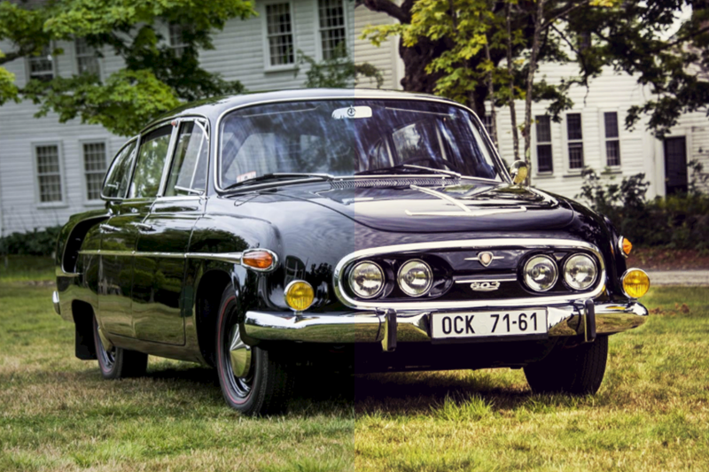

# 3D LUT Effect

Shader code and post processing effect for applying 3d color LUTS. Includes file loaders for the [.cube](https://wwwimages2.adobe.com/content/dam/acom/en/products/speedgrade/cc/pdfs/cube-lut-specification-1.0.pdf) and [.3dl](http://download.autodesk.com/us/systemdocs/help/2011/lustre/index.html?url=./files/WSc4e151a45a3b785a24c3d9a411df9298473-7ffd.htm,topicNumber=d0e9492) LUT formats. Tetrahedral interpolation strategy from [here](http://www.ijetch.org/papers/318-T860.pdf).

Example LUTs provided by [rocketstock.com](https://www.rocketstock.com/free-after-effects-templates/35-free-luts-for-color-grading-videos/) and [freepresets.com](https://www.freepresets.com/product/free-luts-cinematic/).

Submitted in [PR #20558](https://github.com/mrdoob/three.js/pull/20558) to three.js.

_Before / After. Car image from [wallpaperflare.com](https://www.wallpaperflare.com/tatra-tatra-603-czechoslovakia-socialist-car-v8-aerodynamic-wallpaper-pqflw)._

[Demo Here](https://gkjohnson.github.io/threejs-sandbox/3d-lut/).

## Other Formats
- [CSP](http://www.digitalvision.tv/w/images/9/9d/UM.nucoda.pdf) LUT loader.
- [ICC Profile](http://www.color.org/icc32.pdf) LUT loader.
- Possibly image-based LUT loader?
- More formats: https://community.acescentral.com/t/best-of-existing-lut-formats/1703/2

## Possible Improvements
- Use a grid layout rather than a linear layout to avoid unusably long textures when using dense LUT table.
- Improve TetrahedralUpscaler performance by caching tetrahedron face areas and normals.

## References

- https://helpx.adobe.com/photoshop/using/export-color-lookup-tables.html
