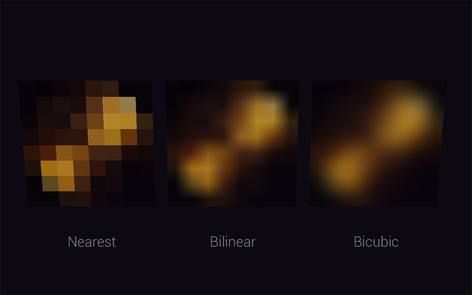

# Bicubic Texture Filtering

Example of bicubic texture filtering from [here](https://stackoverflow.com/questions/13501081/efficient-bicubic-filtering-code-in-glsl).

[Demo](https://gkjohnson.github.io/threejs-sandbox/bicubic-filtering/)

## Possible Improvements

- Use tricubic filtering to interpolate between mipmaps.
