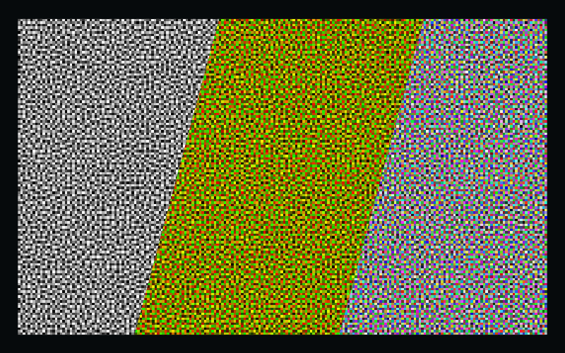

# Blue Noise Generation

_
1, 2, and 3 channel blue noise
_

Class for generating blue noise textures and example for generating monochrome or RGB variations.

[Demo Here](https://gkjohnson.github.io/threejs-sandbox/blue-noise-generation/).

## TODO

- Make a 3D blue noise generator.
- Investigate Hilbert indices in shader (https://www.shadertoy.com/view/3tB3z3)

## References

- http://cv.ulichney.com/papers/1993-void-cluster.pdf
- http://momentsingraphics.de/BlueNoise.html (includes sample textures)
- http://extremelearning.com.au/unreasonable-effectiveness-of-quasirandom-sequences/
- https://gist.github.com/pixelmager/5d25fa32987273b9608a2d2c6cc74bfa
- https://github.com/Atrix256/SampleZoo
