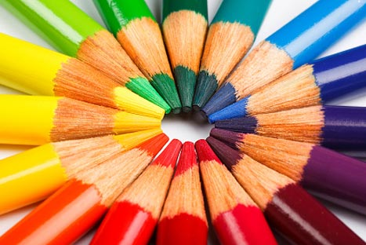

# Colorblindness Utils

Javascript and shader code color utilities for converting RGB colors to simulate blind vision.

 
 

[Demo Here](https://gkjohnson.github.io/threejs-sandbox/colorblindness-utils/index.html).

Pencil images from http://www.colourblindawareness.org/.

## References
- http://moinmo.in/AccessibleMoin?action=AttachFile&do=view&target=daltonize.py
- http://www.daltonize.org/search/label/Daltonize
- http://web.archive.org/web/20081014161121/http://www.colorjack.com/labs/colormatrix/
- http://mapeper.github.io/jsColorblindSimulator/
- https://ixora.io/projects/colorblindness/color-blindness-simulation-research/

## TODO
- Understand if the functions are supposed to operate on linear or srgb color space.
- Use [this reference](https://ixora.io/projects/colorblindness/color-blindness-simulation-research/) to validate application of color matrices.
