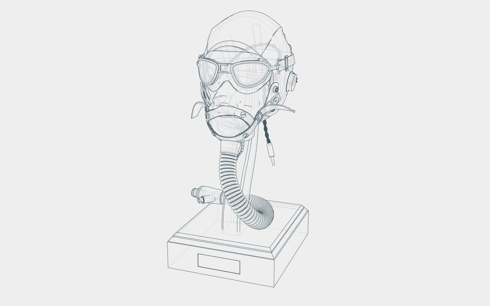

# Conditional Lines

Generalized conditional line shader and geometry generator based on [LDrawLoader](https://github.com/mrdoob/three.js/blob/master/examples/jsm/loaders/LDrawLoader.js) and inspired by [this three.js forum thread](https://discourse.threejs.org/t/ldraw-like-edges/17100) by Prisoner849.

Provides an `OutsideEdgesGeometry` for generating edges based on non-merged edges rather than face normals within a threshold.

[Demo Here](https://gkjohnson.github.io/threejs-sandbox/conditional-lines/).

## Possible Improvements

- Add support for Line2 objects to display fat lines.
- Generate the conditional lines and "hard" lines in a single pass.
- Add support for generating lines at triangle intersections.
