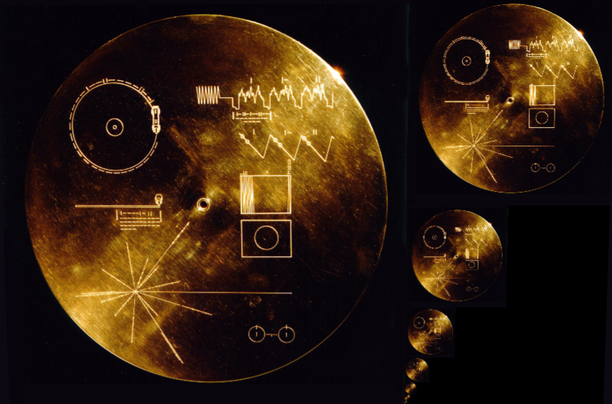

# Custom Mip Map Generation



Utility for generating custom mipmaps for power of two and non power of two textures by packing it into a texture and using custom sample functions. The pixel samples and weights are available to custom logic passed into the `PackedMipmapGenerator` constructor.

[Demo Here](https://gkjohnson.github.io/threejs-sandbox/custom-mipmap-generation/)

**TODO**
- Validate performance specifically when copying data to the back buffer on generation. It would be best to just copy instead of rerunning the mip map code again.
- Add a `MipMapAtlasTarget` class that inherits from `WebGLRenderTarget` it's easier to track what's been rendered to it and includes member getters for `originalWidth`, `originalHeight`, and `mipLevels`.
- Provide shader macro functions in mip map generation helper to avoid unneeded texture samples in case you want a sparser sample distribution like every other pixel.

# Use

```js
import { PackedMipmapGenerator } from './src/PackedMipmapGenerator.js';

// ...

const traditionalMipMapper = new PackedMipmapGenerator(
	`
	for ( int i = 0; i < SAMPLES; i ++ ) {

		gl_FragColor = samples[ i ] * weights[ i ];

	}
	`
);

mipMapper.update( texture, target, renderer );
mipMapper.dispose();

const maxMipMapper = new PackedMipmapGenerator(
	`
	for ( int i = 0; i < SAMPLES; i ++ ) {

		gl_FragColor = max( samples[ i ], gl_FragColor );

	}
	`
);

mipMapper.update( texture, target, renderer );
mipMapper.dispose();
```

# API

## PackedMipmapGenerator

### constructor

```js
constructor( logic : string )
```

Takes a block of code to generate the next mip level. Must set the `gl_FragColor`. An row major array of the parent sample values is available in the `samples` variable and weights in the `weights` variable. The number of samples, pixel width, and pixel height are available in `SAMPLES`, `HEIGHT`, and `WIDTH` defines.

### .update
```js
update( texture : Texture, target : WebGLRenderTarget, renderer : WebGLRenderer ) : Number
```

Takes a texture to turn into a mip pyramid, a target to to render the pyramid into, and a renderer to render with. Returns the number of mips generated.

### .dispose
```js
dispose() : void
```

Disposes of any created context objects.

## Sample Functions

### packedTexture2DLOD

```glsl
// point sampled
vec4 packedTexture2DLOD( sampler2D texture, vec2 uv, int level )
vec4 packedTexture2DLOD( sampler2D texture, vec2 uv, int level, vec2 originalSize )

// interpolated
vec4 packedTexture2DLOD( sampler2D texture, vec2 uv, float level )
vec4 packedTexture2DLOD( sampler2D texture, vec2 uv, float level, vec2 originalSize )
```

```js
// The sampler with the packed mipmaps
texture : sampler2D

// The uv in [ 0.0, 1.0 ] to sample
uv : vec2

// The mip level to sample
level : int | float

// The original size of the texture converted into the mipmap texture
// if the texture was generated with power to two enabled then this
// must be the power of to size. This is only useful for NPOT textures.
originalSize : vec2
```

Shader functions for sampling the generated texture at a specific mip level. If the int variant is used only a single texture sample is made.
