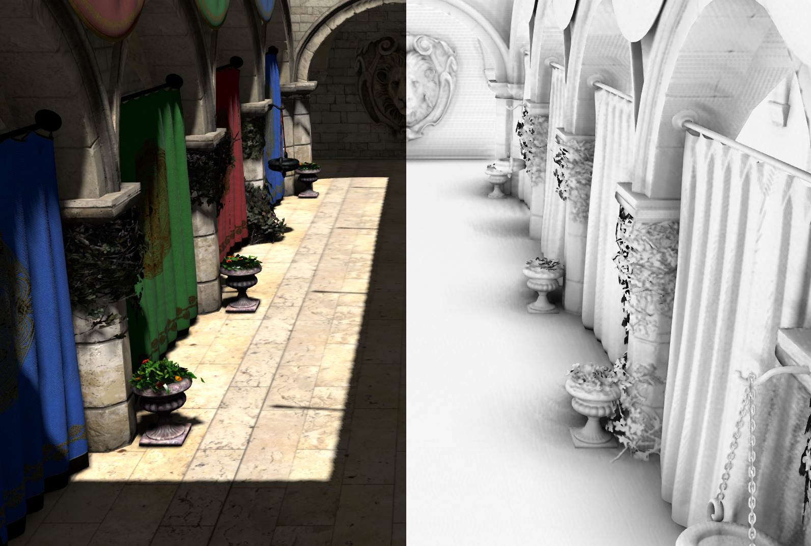
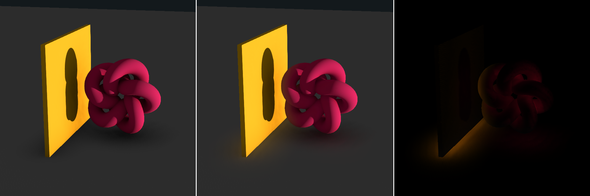

# Ground Truth Ambient Occlusion

_
ambient occlusion
_

_
bounce light
_

GTAO implementation based on Asylum Tutorials work [here](https://github.com/asylum2010/Asylum_Tutorials/blob/master/ShaderTutors/54_GTAO/).

[Demo here](https://gkjohnson.github.io/threejs-sandbox/gtaoPass/)

# Future Work
- horizon sample reuse
- Code cleanup
- Fix loop unroll
- separable blur
- Manually assignable rotation and radius offsets
- expose offset variables explicitly
- toggle normal map / alpha map support
- Use depth texture

# Other considerations

**Noise**
- Disocclusion Blur (https://www.youtube.com/watch?v=3EdE38iRn2A @ 3:08)

**Features**
- See toystory presentation on sample reuse.
- Manually assignable rotation and radius offsets

**Performance Knobs**
- option to generate normal / use normal in upscale
- seperable blur
- switch float depth buffer to simpler type
- toggle normal map / alpha map support
- consider a single sample per tap? Reuse horizon?
- merge depth and normal maps?
- improve gpu memory use

**More**
- expose offset variables explicitly
- Check out https://github.com/MaxwellGengYF/Unity-Ground-Truth-Ambient-Occlusion
- toggle normal map / alpha map support
- http://www.klayge.org/material/4_1/SSGI/SSDO.pdf
- https://80.lv/articles/ssrtgi-toughest-challenge-in-real-time-3d/
- https://www.reddit.com/r/Unity3D/comments/a64ybh/ssil_lighting_in_screen_space/
- https://twitter.com/marcinignac/status/1266307922679775234
- https://github.com/haolange/Unity_ScreenSpaceTechStack

# References

- https://github.com/haolange/Unity_ScreenSpaceTechStack
- https://www.reddit.com/r/Unity3D/comments/a64ybh/ssil_lighting_in_screen_space/
- http://www.klayge.org/material/4_1/SSGI/SSDO.pdf
- https://80.lv/articles/ssrtgi-toughest-challenge-in-real-time-3d/
- https://github.com/MaxwellGengYF/Unity-Ground-Truth-Ambient-Occlusion
- https://github.com/asylum2010/Asylum_Tutorials/blob/master/ShaderTutors/54_GTAO/main.cpp
- https://github.com/asylum2010/Asylum_Tutorials/blob/4f2bc39a8ae69db1ceb59e9a763ef91c7b3dc6de/ShaderTutors/Common/gtaorenderer.cpp
- https://github.com/asylum2010/Asylum_Tutorials/blob/master/Media/ShadersGL/gtao.frag
- https://www.youtube.com/watch?v=mIE3DNbeVvY
- https://www.youtube.com/watch?v=7VPb8mZiIrs
- http://developer.download.nvidia.com/assets/gamedev/files/sdk/11/SSAO11.pdf
- http://citeseerx.ist.psu.edu/viewdoc/download?doi=10.1.1.214.6686&rep=rep1&type=pdf
- https://github.com/scanberg/hbao
- http://guitarjawa.net/?page_id=789
- https://docs.nvidia.com/gameworks/content/gameworkslibrary/visualfx/hbao/product.html
- https://developer.download.nvidia.com/presentations/2008/SIGGRAPH/HBAO_SIG08b.pdf
- http://advances.realtimerendering.com/s2010/Ownby,Hall%20and%20Hall%20-%20Toystory3%20(SIGGRAPH%202010%20Advanced%20RealTime%20Rendering%20Course).pdf

