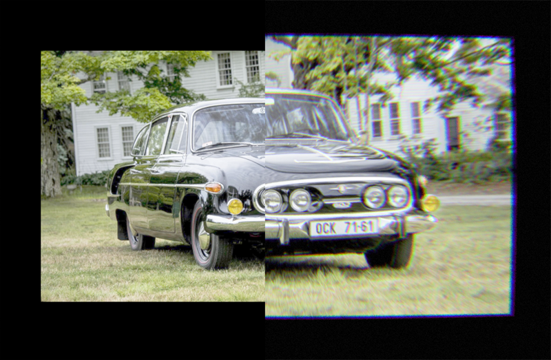

# Lens Effects

Postprocessing effect to add lens distortion and chromatic aberation as well as film grain.

Grain technique based on [this ShaderToy project](https://www.shadertoy.com/view/4t2fRz) and image distortion based on [this article](https://www.taylorpetrick.com/blog/post/dispersion-opengl) and [this paper](https://web.archive.org/web/20061108181225/http://home.iitk.ac.in/~shankars/reports/dispersionraytrace.pdf).

_Before / After. Car image from [wallpaperflare.com](https://www.wallpaperflare.com/tatra-tatra-603-czechoslovakia-socialist-car-v8-aerodynamic-wallpaper-pqflw)._

[Demo Here](https://gkjohnson.github.io/threejs-sandbox/lens-effects/).

# Improvements

- Base the image distortion based on camera FoV and correct view normal.
- Allow noise to darken pixels.
- Look into Brown Conrady distortion
- Assume a normal hemispherical lens when computing normals based on the widest resolution edge. At the moment it uses something closer to an oval model because of aspect ratio of the canvas.

# References

## Grain

- https://www.shadertoy.com/view/4t2fRz
- http://devlog-martinsh.blogspot.com/2013/05/image-imperfections-and-film-grain-post.html
- https://danielilett.com/2019-11-20-tut3-5-filmic-filters/
- https://github.com/mattdesl/glsl-film-grain

## Lens Distortion / Dispersion

- https://danielilett.com/2019-10-17-tut3-1-something-fishy/
- https://codea.io/talk/discussion/8708/barrel-distortion-shader
- [Barrel Blur Chroma](https://www.shadertoy.com/view/XssGz8)
- [Lens / Film Chromatic Aberration](https://www.shadertoy.com/view/llK3RR)
- [Barrel Blur](https://www.shadertoy.com/view/XslGz8)
- [Barrel Distortion](https://www.shadertoy.com/view/lddGDN)
- [Barrel Distortion Tutorial](https://www.shadertoy.com/view/MlSXR3)
- https://web.archive.org/web/20061108181225/http://home.iitk.ac.in/~shankars/reports/dispersionraytrace.pdf
- https://www.taylorpetrick.com/portfolio/webgl/lense
