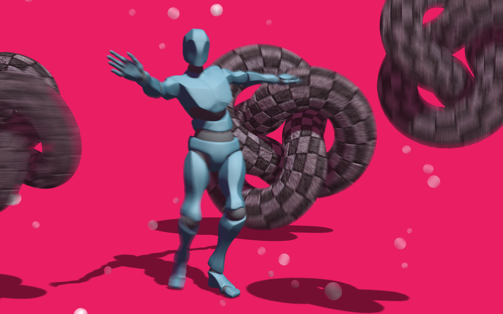

# Per-Object Motion Blur Render Pass

A per-object motion blur pass that works with the THREE.EffectComposer class. Works with meshes and skinned meshes by saving the position on the previous frame and smearing between there and the new position. Morph targets and displacement maps are not accounted for.

[](https://gkjohnson.github.io/threejs-sandbox/motionBlurPass/webgl_postprocessing_perobjectmotionblur.html)

[Demo Here!](https://gkjohnson.github.io/threejs-sandbox/motionBlurPass/webgl_postprocessing_perobjectmotionblur.html)

### Use

```js

// ... set up scene, camera, renderer...

var renderScene = new THREE.RenderPass( scene, camera );
var motionPass = new THREE.MotionBlurPass( scene, camera, options );

var composer = new THREE.EffectComposer( renderer );
composer.setSize( window.innerWidth, window.innerHeight );
composer.addPass( renderScene );
composer.addPass( motionPass );
motionPass.renderToScreen = true;

// ...

function render() {

	composer.render();
	requestAnimationFrame( () => render );

}
render();

```

### API

#### Options

The set of options that can be passed to the MotionBlurPass constructor. These can also be changed by modifying them on the MotionBlurPass instance itself.

```js
{
	// How many steps to samples to take when smearing the motion blur
	// More samples is smoother. This option is only available globally
	// and not overrideable.
	samples: 15,

	// How much to bloat the geometry by along the motion vector
	// This can cause cracks in geometry with hard normals
	expandGeometry: 0,

	// Whether or not to interpolate the geometry between this frame
	// and the previous frame's position. This creates an elongated
	// version of the model
	interpolateGeometry: 1,

	// How intensely to blur the models
	smearIntensity: 1,

	// Whether or not to blur transparent objects
	blurTransparent: false,

	// Whether or not to account for camera motion in the blur
	renderCameraBlur: true
}
```

#### Mesh.motionBlur

All of the options above can be overriden by adding a `motionBlur` overrides object onto the meshes to be rendered.

```js

	var mesh = new THREE.Mesh( geometry, new THREE.MeshPhongMaterial({ transparent: true }));
	mesh.motionBlur = { renderTransparent: true }

```

### TODO Improvements
- Clamp the step count based on distance (max 1 step per pixel)
- Early out if there is no velocity
- Use depth buffer to alleviate foreground bleeding into background blur
- Add dithering / jitter to the smear samples to improve the low sample look
- Use depth to more intelligently sample and keep background crisper
- Blur the velocity buffer to extend in the direction of the velocities
- Use a depth-aware blur and keep track of the primary and secondary velocity vectors
- Iteratively blur the samples
- Don't draw objects that haven't moved, reuse the depth buffer
- Reuse buffers from other postprocessing effects
