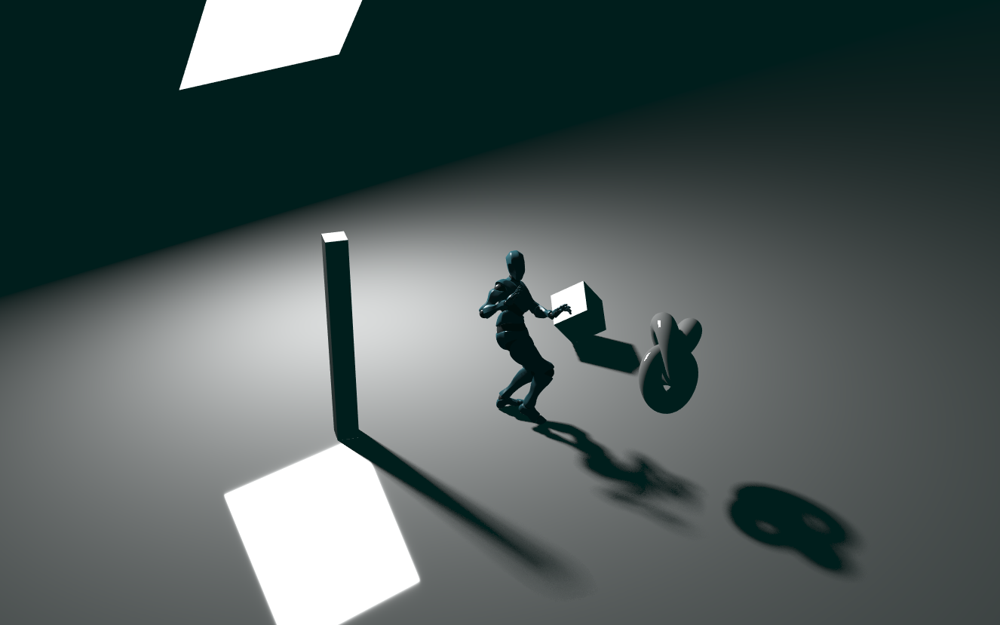

# Percentage Closer Soft Shadows

A hacked in implementation of [NVidia's Percentage Closer Soft Shadows](http://developer.download.nvidia.com/shaderlibrary/docs/shadow_PCSS.pdf) to approximate an Area Light shadow. Poisson disk generation code borrowed from [spidersharma03's PCSS implementation](https://github.com/mrdoob/three.js/blob/master/examples/webgl_shadowmap_pcss.html#L54).

[Demo Here!](https://gkjohnson.github.io/threejs-sandbox/pcss/index.html)

### Possible Improvements
- Cleanly implement so it can be reused / used in multiple lights (area lights cannot cast shadows at the moment, though)
- Afford control over PCF and blocker sample counts
- Optimize the blocker search by using a depth mip map pyramid
- Remove dependency on shadow texture resolution (changing the shadow resolution changes the scale of the blur effects)
- The shadow currently only uses an orthogonally-rendered directional light shadow, which can only cover a portion of the area lights coverage. This also means that the shadows do not shange if the light shifts left or right. Possibly a spot light shadow is more appropriate
- Use a max value depth pyramid to improve traversal time of the shadow map?
- Use blue noise sampling
