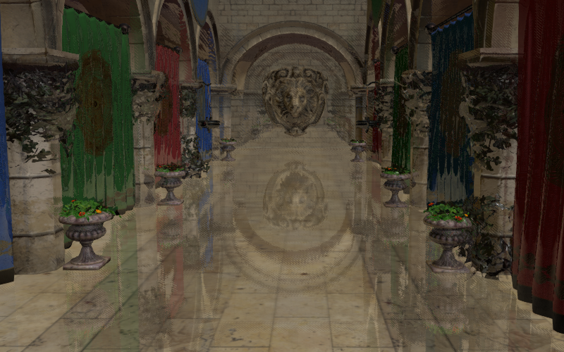

# Screen-Space Reflections Render Pass

A rough screen space reflections implementation based on [Morgan McGuire's screen space ray tracing article](http://casual-effects.blogspot.com/2014/08/screen-space-ray-tracing.html) and [Kode80's Unity SSRR implementation](https://github.com/kode80/kode80SSR).


[](https://gkjohnson.github.io/threejs-sandbox/screenSpaceReflectionsPass/)

_sponza scene from GLTF 2.0 example models_

[Demo here!](https://gkjohnson.github.io/threejs-sandbox/screenSpaceReflectionsPass/)

# API

## SSRRPass

_extends Pass_

### .stride

```js
stride : Number
```

The number of screen space pixels to step over per iteration in the down sampled depth texture.

### .steps

```js
steps : Number
```

The number of steps to take along the cast ray.

### .binarySearchSteps

```js
binarySearchSteps : Number
```

The number of extra iterations to take to search for the intersected surface.

### .intensity

```js
intensity : Number
```

The intensity of the reflection.

### .renderTargetScale

```js
renderTargetScale : Number
```

### .jitter

```js
jitter : Number
```

### .constructor

```js
constructor( scene : Scene, camera : Camera, options : Object )
```

## TODO

### Upcoming

- Blur output based on roughness and ray distance
- For some reason where there are gaps ray marching still seems to occur. Maybe because the case of `F      B     F` (where F is front face is B is back face) is not handled. This is apparent in the spheres scene.

### Bugs
- Improve the connected-ness of the reflections to the ground.
- Objects in the close foreground can create incorrect reflections on the floor / further objects (looks like an interpolated sampling issue?)
- "Black" is considered close to the camera at the moment and is also the same as the clear color. So if there's no background elements then the unrendered space will look like it's "close" to the camera and cause intersections.
	- This is complicated because the depths are negated and in the range `[ near, far ]`. Fix this when the depth is changed to use another format later.
- At really glancing angles (especially far back on the sponza floor when moving the camera down) it looks like the rays are not actually hitting the wall in the back. Maybe it's because it hits itself? Or the depth behind it? Lowering the rendertarget and raymarch scale to 0.2 demonstrates this -- it looks like the pixels are hitting themselves
- The replacement code doesn't work as expected because the original materials are not cached in every replacer -- just the first one.

### Features

- Use a depth pyramid map to raymarch
- Use cheap rays for roughness
- Resolve color using sibling pixels to improve detail. Should ray direction affect this? Should the values be flipped?
- Use a different jitter technique such as Halton or Poisson disks.
- Understand how to render depth target mip pyramid.
- Use mip LoDs for normals, color, depth? to blend the pixels
- Provide a minimum thickness for potentially thin objects?
- Add an option to only use a front side depth and a thickness because non water tight meshes will having streaming coming off like the helmet
- Add alpha test clipping to the pass shaders so the leaves on the planters look correct

### Stretch

- Investigate how incidence angle should play a role
- Test orthographic camera
- Avoid rendering the same data twice (reuse depth buffer from prior renders, other effects)
- Support animations
- Improve rendertarget memory footprint.
- See if we can improve the look of rendering using thickness -- some thin surfaces are missed
- Optionally fall back to environment map
- Understand how roughness and metalness affect the blending model -- reference how environment maps are sampled and applied

### References

-  http://www.cse.chalmers.se/edu/year/2017/course/TDA361/Advanced%20Computer%20Graphics/Screen-space%20reflections.pdf
