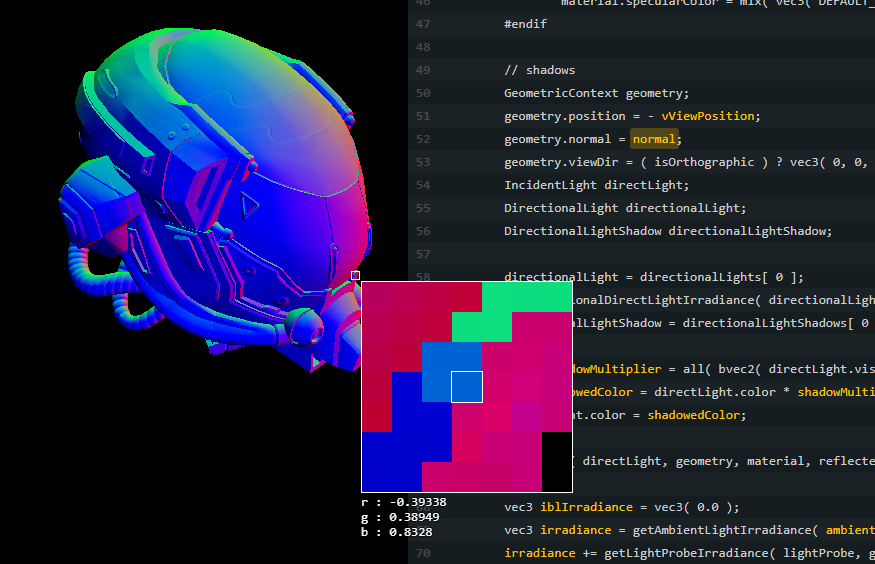

# Shader Debugger

A hacky wrapper with some fancy regex for WebGLRenderer intended to help with debugging and reading data from shaders.



[Demo Here!](https://gkjohnson.github.io/threejs-sandbox/shader-debugger/)

# Use

```js
import { ShaderDebugRenderer } from './src/ShaderDebugRenderer.js';

const debugMaterial = new DebugShaderMaterial( material );
const renderer = new ShaderDebugRenderer();
const shaderDebugger = renderer.shaderDebugger;
shaderDebugger.enable = true;
shaderDebugger.material = debugMaterial;

debugMaterial.setFragmentOutputVariable( 'diffuse', 'vec4', 200 );
const result = debugMaterial.readPixel( x, y, 'vec4' );
```

# API

## Definition

### .index

```js
index : Number
```

The end of the statement after the variable is set.

### .name

```js
name : String
```

The name of the variable being set.

### .type

```js
type : String
```

The type of the variable.

### .prefix

```js
prefix : String
```

The type of variable definiton -- `uniform`, `attribute`, `varying`, or `null` for local variables.

## DebugShaderMaterial

### .constructor

```js
constructor( shader : Shader | ShaderMaterial )
```

Takes a shader or shader material to debug.

### .targetMaterial

```js
targetMaterial : ShaderMaterial
```

The material to debug.

### .fragmentDefinitions
### .vertexDefinitions

```js
{
	varyings: Array<Definition>,
	uniforms: Array<Definition>,
	attributes: Array<Definition>,
	localVariables: Array<Definition>,
}
```

The variable definitions found in the vertex and fragment shaders.

### .updateDefinitions

```js
updateupdateDefinitions() : void
```

Updates the member definitions.

### .setVertexOutputVariable

```js
setVertexOutputVariable(
	name : String,
	type : String,
	index = null : Number,
	condition = null : String
) : void
```

Inserts a statement to output the variable with the given name. Can also take a statement that sets gl_FragColor.

### .setFragmentOutputVariable

```js
setFragmentOutputVariable(
	name : String,
	type : String,
	index = null : Number,
	condition = null : String
) : void
```

Inserts a statement to output the variable with the given name. Can also take a statement that sets gl_FragColor.

### .clearOutputVariable

```js
clearOutputVariable() : void
```

Clears the modifications to the shaders.

### .reset

```js
reset() : void
```

Copies all uniforms from the original target material.

## ShaderDebugRenderer

_extends WebGLRenderer_

A wrapper for the WebGLRenderer that allows for displaying and inspecting pixels rendered from a debug shader by zooming in and reading their values.

When `render` is called while `enableDebug` is true _and_ the scene contains an object using the debug material the scene is instead rendered with a black background and only the objects with the debug material. When hovering over the canvas a zoomed in view of the pixels is displayed with the value of the output field.

### .enableDebug

```js
enableDebug = false : Boolean
```

Whether to enable the debugging.

If debugMaterial target material is not set or not found in the scene being rendered then the default rendering behavior will be used.

### .debugMaterial

```js
debugMaterial = null : ShaderMaterial
```

The material to debug.

### .inspectorScale

```js
inspectorScale = 20 : Number
```

The magnification size of the pixels.

### .inspectorDimensions

```js
inspectorDimensions = 5 : Number
```

The number of pixels to display in each dimension in the magnification.

# Possible Improvements

## Shader Code Parsing
- Use a proper syntax parser to extract variables, scope, and structures ([reference 1](https://github.com/lammas/glsl-man), [reference 2](https://github.com/burg/glsl-simulator), [reference 3](https://github.com/stackgl/glsl-parser) -- these projects use a glsl pegjs grammar file from Google). See browser version of glsl-man [here](https://github.com/gkjohnson/glsl-man/).
- Differentiate between a variable being used and being set so we can display the value being passed in vs what gets set -- consider `normal = normal * 2.0`
- Process #define code paths so we don't see code that isn't being used or fade the sections out
- Don't extract samplers or anything that can't be returned correctly.
- Clean up code redundancy
- Allow for stepping through functions by ensuring that `gl_FragColor` is not set anywhere else and setting it mid call.
- Handle conditionals

## Example
- Allow for adding conditionals or custom outputs
- Allow for modifying material uniforms.
- exclude comments from variable highlights
- Allow for zooming the canvas in and out to get a better view at pixels or allow for target scaling
