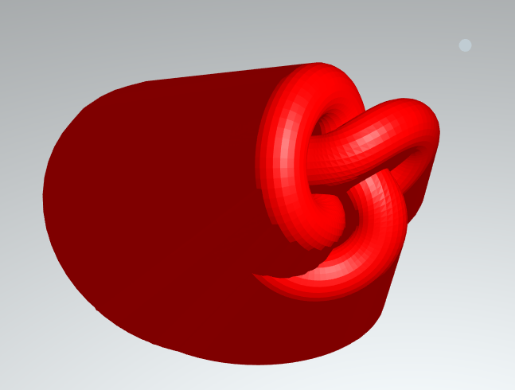
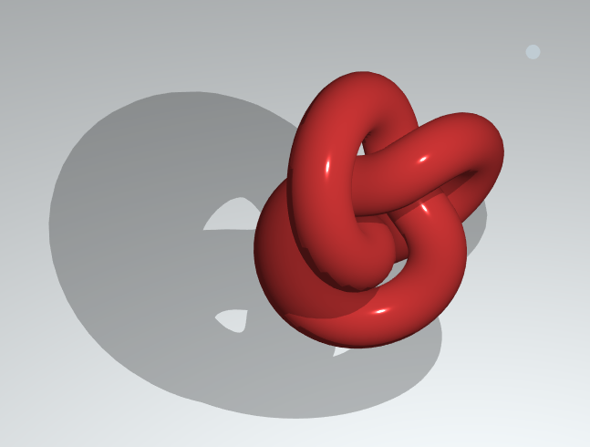

# Shadow Volumes

A shader-based approach to rendering shadow volumes with THREE js to enable crisp (never soft...) shadows. Shadow volume reference available [here](http://nuclear.mutantstargoat.com/articles/volume_shadows_tutorial_nuclear.pdf).

[Demo Here!](https://gkjohnson.github.io/threejs-sandbox/shadow-volumes/index.html)

_The volume 3d volume generated to stencil a shadow tint._

_The resultant shadow rendered from the shadow volume._

## Approach

- Clone the geometry to create a shadow volume for.
- Create quads bridging _every_ connected edge in the geometry.
- Create per-face normals for every triangle
- Create a shader that will project vertices facing away from the light based on their normal to create the volume.
- Render the geometry with stencil operations in _five_ passes (twice for front and back faces while checking depth, twice without checking depth, and once for the final tint).

## Potential Improvements
- Geometry is tinted after the fact meaning lighting effects have already been applied so specular highlights will show up dimmed in the shadows. This could be solved with a deferred render pipeline.
- Fix the tinting of the geometry that is casting shadows itself (and causing stepped artifacts).
- Support morph targets.
- Render a full screen quad to tint the shadows after all the volumes have been stenciled instead of rendering each geometry a fifth time.
- Provide a cpu-based implementation of the shadow volumes.
- Provide an option to _not_ perform two of the unnecessary renders of the volume if there's no risk of the camera being inside the volume.
- Provide a warning if not all edges are bridged
- Support spot lights
- Add quads between all the bridges so no light leaking occurs.
- Use three.js stencil materials
