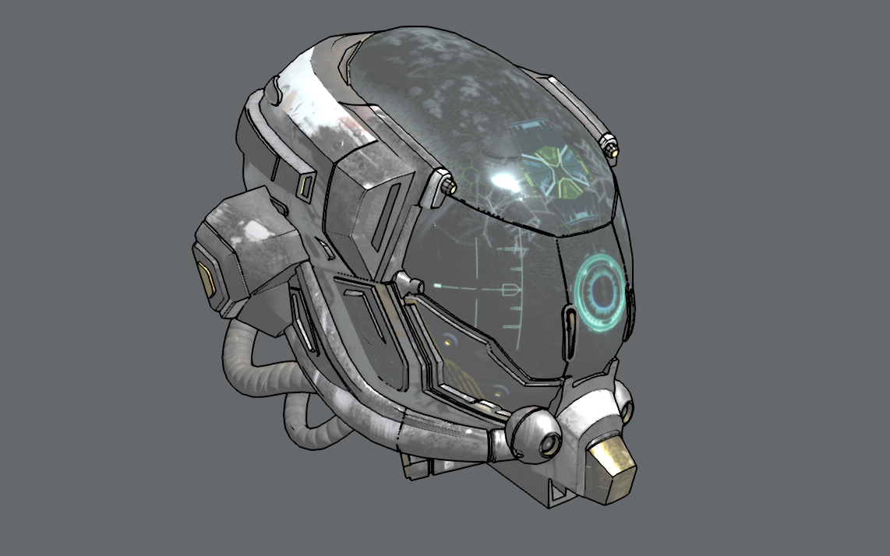

# Sobel Outline

Sobel outline postprocessing that uses normal and depth buffers based on technique outlined [here](https://www.vertexfragment.com/ramblings/unity-postprocessing-sobel-outline/#normal-based-outline).

Demo [here](https://gkjohnson.github.io/threejs-sandbox/sobel-outline/)!

## Possible Improvements

- Take more samples to avoid disconnected outlines (3x3 grid).
- Render as white if the value is less than some threshold like 0.5 (or stretch outside of some threshold to retain soft edges or AA).
- Expose exponent to control outline cutoff.
