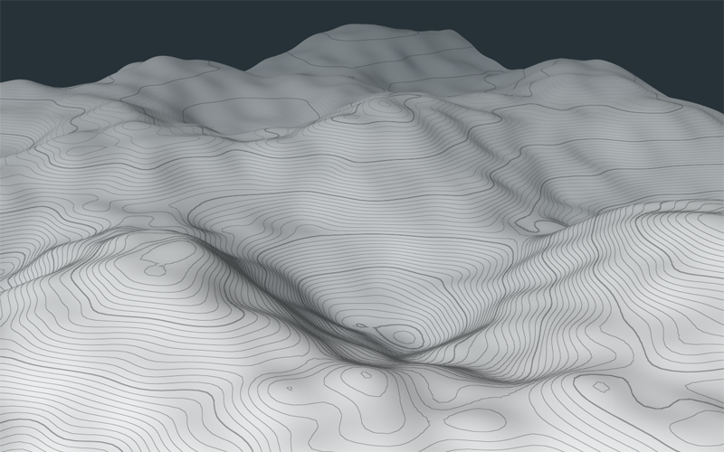

# topography-shader

A topographic shader with consistently thick contour lines and a terrain geometry class that represents heights as rectangular towers for proper image-based height map representation.

[Demo here!](https://gkjohnson.github.io/threejs-sandbox/topography-shader/)

# Things to do

- The geometry uses full cubes to represent each tower which can lead to a lot of overdraw and extra faces. Try to use a double-size plane and treat strips between the tops of the geometry as the connective sides.
- Use a nicer looking piece of terrain.
- Fix subpixel aliasing at steep viewing angles.
- Afford disabling the base color so we just have topolines.
