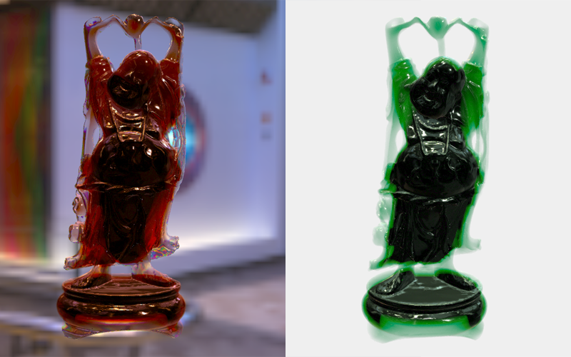

# Translucent Material

A posteffect that renders translucently with modeled light dispersion, refraction, and absorption using depth peeling.

Demo model loaded from the [alecjacobson/common-3d-test-models repo](https://www.github.com/alecjacobson/common-3d-test-models).

[Demo Here](https://gkjohnson.github.io/threejs-sandbox/translucent-material/index.html).

## Possible Improvements

- Make it physically based
- Test with multiple meshes
- Subsurface scattering
- Jitter sampling for blur / diffusion
- Blur depth accumulation
- Shadows
- light should be absorbed at an exponential rate rather than linear?
- performance
- Provide option to just use front faces and back faces.
- Use directional light to perform subsurface scattering
- Manually discard against scene depth
- Possibly we don't need an alpha channel for the accumulation buffer.
- Blur the transmission values using multiple jittered samples per frame or mip map samples.

## Limitations

- Objects cannot penetrate.
- Refracted normal does not accumulate (does not refract into transparent object behind)

## Fields

- `transmissionDispersionAbbe`
- `transmissionIOR`
- `transmissionFactor`
- `trasmissionScatter`

## References

- https://docs.arnoldrenderer.com/display/A5AFMUG/Transmission
- http://wili.cc/research/translucency/hftrans.pdf
- https://github.com/mrdoob/three.js/issues/15941
- https://github.com/mrdoob/three.js/issues/15440
- https://discourse.threejs.org/t/depth-peel-and-transparency/5365
- https://github.com/mrdoob/three.js/issues/14049

### Other

- https://www.cs.umd.edu/gvil/papers/hao_tog04.pdf
- https://research.nvidia.com/sites/default/files/pubs/2017-03_Phenomenological-Transparency/McGuire2017Transparency.pdf
